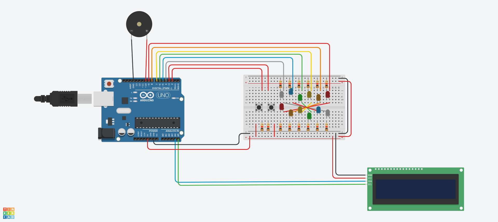

# Ardify – Arduino Music Player with Lighting

A simple Arduino project simulating Music player using a piezo, built and tested in Tinkercad.

---

## 📖 Documentation
- [Setup Guide](docs/setup_guide.md) – Step-by-step instructions for simulation and hardware setup.

## 📌 Overview
**Ardify** is an Arduino-based music player that uses a piezo buzzer to play tunes, an LCD screen to display song names, and LED lighting for dynamic visual effects. This project is ideal for learning about Arduino, sensors, and multimedia integration.

**Tinkercad Project:** [Open in Tinkercad](https://www.tinkercad.com/things/97JWZVqkdDX-arduify)

---

## 🛠 Components
| Component         | Quantity | Notes                     |
|-------------------|----------|---------------------------|
| Arduino Uno       | 1        | Microcontroller board     |
| Breadboard        | 1        | For prototyping           |
| Piezo Buzzer      | 1        | For music playback        |
| LED               | 12       | Lighting effects          |
| 220Ω Resistor     | 14       | Current limiting          |
| Push Buttons      | 1        | Song navigation           |
| LCD Display 16x2  | 1        | Display songs             |
| Jumper Wires      | Several  | Connections               |

---

## 📐 Circuit Diagram

---

## 💡 How It Works
1. **Song Selection:** Use buttons to cycle through songs displayed on the LCD.
2. **Music Playback:** The piezo buzzer plays the selected melody.
3. **Lighting Effects:** LEDs flash or fade in sync with the music.

---

## 🚀 Simulation & Usage

### In Tinkercad:
1. Open the [Tinkercad project](https://www.tinkercad.com/things/97JWZVqkdDX-arduify).
2. Click "Start Simulation."
3. Use the buttons to select and play songs.

### On Hardware:
1. Assemble the circuit as shown in the schematic.
2. Upload the code to your Arduino.
3. Use the buttons to navigate and play songs.